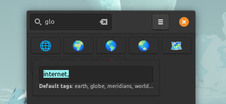
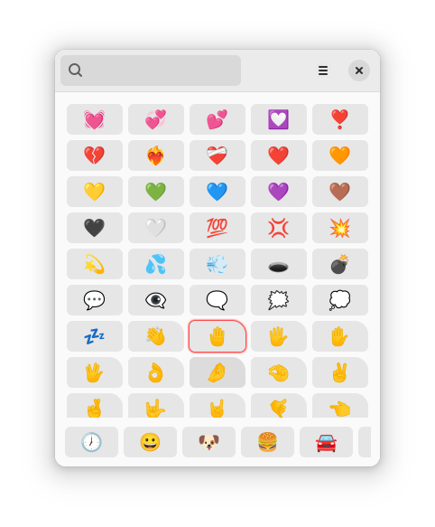
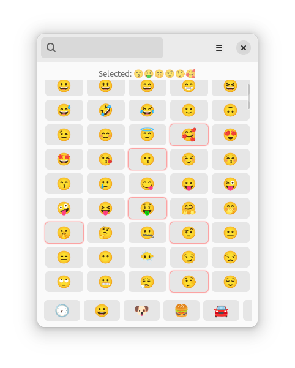
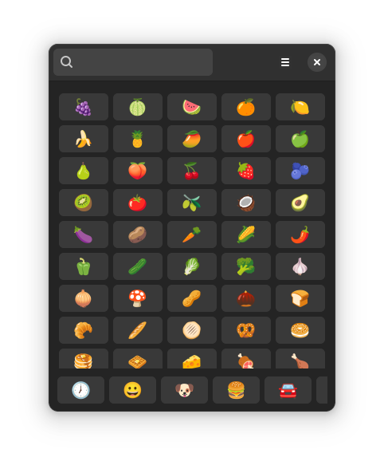
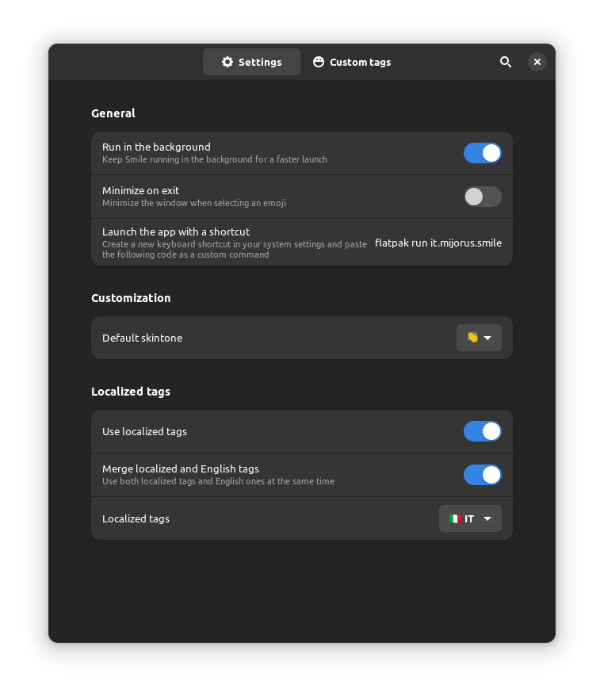

# Smile
<p align="center">
  
</p>


<p align="center">
 <a href="https://flatstat.mijorus.it/app/it.mijorus.smile"  align="center">
  
</a>
</p>

<!-- vscode-markdown-toc -->
* 1. [Download](#Download)
* 2. [Features](#Features)
	* 2.1. [Localized tags + english fallback!](#Localizedtagsenglishfallback)
	* 2.2. [Custom tags](#Customtags)
	* 2.3. [Custom shortcut](#Customshortcut)
	* 2.4. [Skintone selector](#Skintoneselector)
	* 2.5. [Multi selection](#Multiselection)
* 3. [Changelog](#Changelog)
* 4. [Source](#Source)
* 5. [Third party licences](#Thirdpartylicences)
* 6. [Building](#Building)
* 7. [Thanks to](#Thanksto)
* 8. [Some more screenshots](#Somemorescreenshots)

<!-- vscode-markdown-toc-config
	numbering=true
	autoSave=true
	/vscode-markdown-toc-config -->
<!-- /vscode-markdown-toc -->

##  1. <a name='Download'></a>Download
<a href="https://flathub.org/apps/details/it.mijorus.smile" align="center">
  
</a>

Note: Flathub and Github are the only official release channels for Smile. Any release on external marketplaces or packaging formats are unofficial and not supported by me.

##  2. <a name='Features'></a>Features

Smile is a simple emoji picker for linux with **custom tags support**.

###  2.1. <a name='Localizedtagsenglishfallback'></a>Localized tags + english fallback!

#### English fallback!
Go to `Preferences > Localized tags > Merge localized tags`!

###  2.2. <a name='Customtags'></a>Custom tags
No matter how many tags we put in, there is always going to be that one emoji which you expect to show up when you enter a specific query, but it doesn't.

An example?  
Do you want 🌐 to show up when you search for "internet", but it is only tagged as "globe"? 

Select the icon using the arrow keys and press `Alt + T` or middle click to insert "internet" as custom tag.

<p align="center">
  
</p>

###  2.3. <a name='Customshortcut'></a>Custom shortcut
This app does not register its own system-wide shortcut, but you can create your custom shortcut for Smile by launching this command: 

`flatpak run it.mijorus.smile`

###  2.4. <a name='Skintoneselector'></a>Skintone selector

Press `Alt + E` or `Right Click` on any emoji with the **rounded top-right** corner (see screenshot below).
<p align="center">
  
</p>

###  2.5. <a name='Multiselection'></a>Multi selection
Use `Shift + Enter` to select multiple emojis; use `Ctrl+Enter` to quit without selecting an additional emoji
<p align="center">
  
</p>


##  3. <a name='Changelog'></a>Changelog
Please check out [https://smile.mijorus.it/changelog](https://smile.mijorus.it/changelog)

##  4. <a name='Source'></a>Source
<a href="https://github.com/mijorus/smile" align="center">
  
</a>

##  5. <a name='Thirdpartylicences'></a>Third party licences
Awesome resources that made Smile possible:

- [Openmoji](https://openmoji.org/) for the emoji list and english tags
- [Emojibase](https://github.com/milesj/emojibase) for the translated tags available since version 1.70

##  6. <a name='Building'></a>Building 
You will need:
- flatpak
- flatpak-builder
- flatpak-builder
- org.gnome.Platform 43
- org.gnome.Sdk 43

```sh
git clone https://github.com/mijorus/smile.git
cd smile

# kill any instance of Smile
flatpak kill it.mijorus.smile

# to run the app:
flatpak-builder build/ it.mijorus.smile.json --user --force-clean
flatpak-builder --run build/ it.mijorus.smile.json smile

# to install the app
flatpak-builder build/ it.mijorus.smile.json --user --install --force-clean
```

##  7. <a name='Thanksto'></a>Thanks to

- [Emote](https://github.com/tom-james-watson/Emote) for the inspiration and some code

##  8. <a name='Somemorescreenshots'></a>Some more screenshots
<p align="center">
  
</p>
<p align="center">
  
</p>